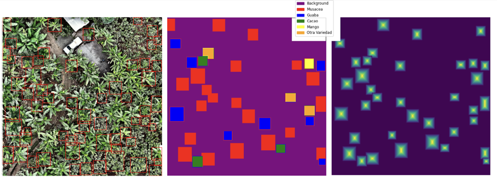

# Tropical Forest Carbon Accounting through Deep Learning-Based Species Mapping And Tree Crown Delineation



## Why is Carbon Accounting Important? 

Tropical forests are essential ecosystems recognized for their carbon sequestration and biodiversity benefits. As the world undergoes a simultaneous data revolution and climate crisis, accurate data on the world’s forests is increasingly important. The importance is particularly stark for burgeoning **climate offset markets**, reliant on **accurate and verifiable estimates of carbon storage** provided by afforestation or preventative deforestation. 

## What Does This Project Do? 

This project combines several pieces of innovative research in the fields of Deep Learning and Dendrology, creating a **one-stop comprehensive pipeline** to take an RGB aerial imagery as an input and output individual tree-level carbon sequestration metrics. The current project is groundtruthed to assess accuracy, but theoretically, this procedure could be applied to any RGB aerial imagery and, without any additional data, output tree-specific carbon estimations. 

It combines: 

- Two state-of-the-art **Single-Encoder, Double-Decoder (SEDD) models** developed specifically for this project, inspired by La Rosa et al. (2021) and Martins et al. (2021). 
    - The SEDD models are similar to one another but have different loss calculation techniques, a difference explained more in the Report. They are called S-SEDD for Species-SEDD and DS-SEDD for Distance/Species SEDD. 
- A fine-tuned version of the **DeepForest model**, developed by Weinstein et al. (2020) and accessible at https://github.com/weecology/DeepForest.
- A **custom diameter at breast height (DBH) model** using XGBoost ensembling to predict DBH based on bounding box information outputted by DeepForest and species information from the SEDD model. 
- **Five custom statistical models** to predict above-ground biomass (AGB) based on DBH; each model is aligned to a particular tree species. 

Taken together, these pieces provide a proof of concept for being able to take an RGB image and output tree-level carbon estimations. 

## Raw Data

You can download the raw data from OneDrive: [Download Raw Data](https://imperiallondon-my.sharepoint.com/:f:/g/personal/ger23_ic_ac_uk/EgHyQUJHHwBBmAPldgLDud0B0v79zZgRLsm1e4_5oKbDBw?e=axIXC7).

The data is already organized in a folder structure that the project expects. Follow these steps to set up your local environment:

1. **Clone the Repository:**

   ```bash
   git clone https://github.com/ese-msc-2023/irp-ger23.git
   cd irp-ger23
   ```

2. **Download the Data from OneDrive** 

    It should contain: The downloaded data should contain the following sub-folders: csv_files, data, models, pkl_files. 

3. **Confirm Directory Structure**

    Move downloaded data into the ReforesTree folder of the cloned repo so the structure looks like this: 

    ```bash
    irp-ger23/
    ├── ReforesTree/
    │   ├── csv_files/
    │   ├── data/
    │   ├── models/
    │   └── pkl_files/
    ├── README.md
    └── ... (other files)
    ```

*This OneDrive is currently accessible by anyone associated with Imperial College London.*

## Installation Instructions

To set up the environment for this project, follow these steps:

1. **Create a Conda environment from the provided environment.yml file** 

   ```bash
   conda env create -f environment.yml
   conda activate IRP_2
   ```
2. **Verify Installation** 

   ```bash
   conda list
   ```
    This will list all installed packages and their versions to ensure that everything is set up as expected. You can refer back to the environment.yml file to make sure everything aligns. 

## Using this Repo 

There are three folders in this repository: 

1. deliverables: In this folder, you can find answers to all your academic questions! It's home to the initial project plan, the final report, and some very pretty presentation slides. 

2. title: A simple folder, this only contains a toml file with the project name for record-keeping purposes. 

3. ReforesTree: The heart of the code! And a folder named in honor of the project that provided the data for this effort, a database developed by Reiersen et al. (2022) to encourage "the fellow machine learning community to take on the challenge of developing low-cost, scalable, trustworthy and accurate solutions for monitoring, verification, and reporting of tropical reforestation inventory." More info on their project is available at https://github.com/gyrrei/ReforesTree. 

### The ReforesTree Folder 

Within the ReforesTree Folder, you will find 11 files. A quick note on what each of them does and how they fit into the overall pipeline. Also, *each of these files is developed to use the data of the current project, found in the OneDrive mentioned above*. 

First, there are four **Python files**. These can be divided into two **util files** and two **scripts for running training and evaluation** 

Scripts: 
1. **[DS-SEDD_model.py](ReforesTree/DS-SEDD_model.py)**: Running this script trains and evalutes the DS-SEDD model.
2. **[S-SEDD_model.py](ReforesTree/S-SEDD_model.py)**: Running this script trains and evaluates the S-SEDD model. 

Utils: 
1. **[data_utils.py](ReforesTree/data_utils.py)**: This file provides utilities and helper functions for all non-model related tasks—enhancing images, handling bounding boxes, performing various pre-processing and post-processing, calculating AGB, and visualization. It is split into sections for pre-processing, post-processing, and applying allometric equations. 
2. **[model_utils.py](ReforesTree/model_utils.py)**: This file provides utilities and helper functions for all model-related tasks. It is split also into sections, each one representing a different model development process. The sections are DeepForest Training, Diameter Model, SEDD model (inclusive of both S-SEDD and DS-SEDD), and allometric equation development. 

Next, there are seven **Jupyter Notebooks**, giving the user a behind-the-scenes look into the iterative process of model development as well as pre and post processing. Comments and markdown cells in those individual notebooks will provide even more context. 

Model development: 
1. **[model_development.ipynb](ReforesTree/model_development.ipynb)**: Grabbing the model_development moniker is the notebook behind the main model of the project—the SEDD model. Since the S-SEDD and DS-SEDD models are submitted for training and evaluation via scripts, this notebook mostly serves as a testing ground. Representative of the S-SEDD model, it uses a smaller data frame to visualize and test the training process. 
2. **[allometric_equations.ipynb](ReforesTree/allometric_equations.ipynb)**: This notebook details the process of training, validating, testing, and choosing the AGB prediction model, including other models that were not chosen. 
3. **[diameter_model.ipynb](ReforesTree/diameter_model.ipynb)**: As with the allometric_equation notebook, this notebook details the process of training, validating, and testing the DBH model. It also includes other attempted models that were not chosen. 
4. **[deep_forest_training.ipynb](ReforesTree/deep_forest_training.ipynb)**: Not quite model development, this file shows the fine-tuning process of the DeepForest model as well as generates the bounding box outputs to be used in post-processing alongside the outputs from the SEDD evaluation. 

Pre and post processing: 
1. **[pre_processing.ipynb](ReforesTree/pre_processing.ipynb)**: It is what it sounds like—a notebook focused on pre-processing, including testing different image enhancements, culling tiles with too much white space, and counting how often each species appears in the data. 
2. & 3. **[S-SEDD_post_processing.ipynb](ReforesTree/S-SEDD_post_processing.ipynb)** and **[DS-SEDD_post_processing.ipynb](ReforesTree/DS-SEDD_post_processing.ipynb)**: These virtually identical files load in the outputs from the two different SEDD models, kept distinct so final solutions can be compared. They complete the pipeline, combining the output from the SEDD models with the DeepForest model, then passing that combined data frame to the DBH model, before using the custom AGB models to predict biomass and using simple math to calculate carbon sequestration potential. 

### Testing 

A comprehensive testing system is provided via doctests, run in model_utils and data_utils by executing the following command: 

```bash
python -m doctest model_utils.py
python -m doctest data_utils.py
```
## License

This project is licensed under the [MIT License](LICENSE.txt). See the [LICENSE](LICENSE.txt) file for details.

## Final Note on Citation

Full citations for academic research can be found in the Report, present in this repo. The code was developed using VS Code with GitHub Copilot enabled.

## Contact 

For any questions, feel free to contact Georgia Ray (ger23@ic.ac.uk)


